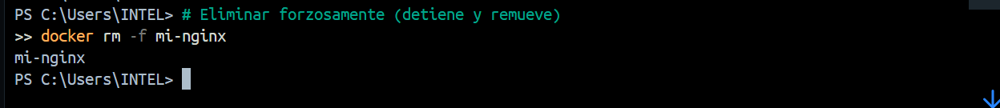
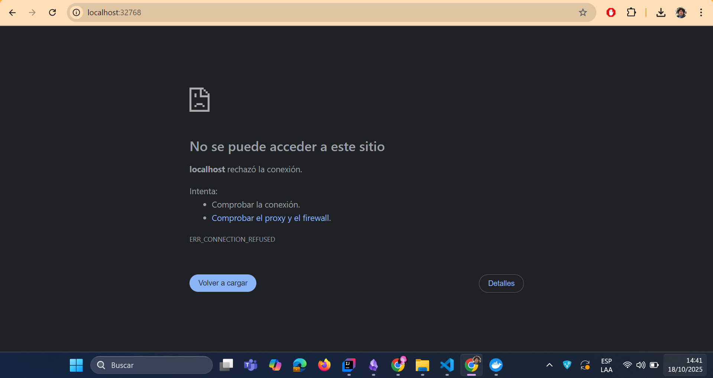
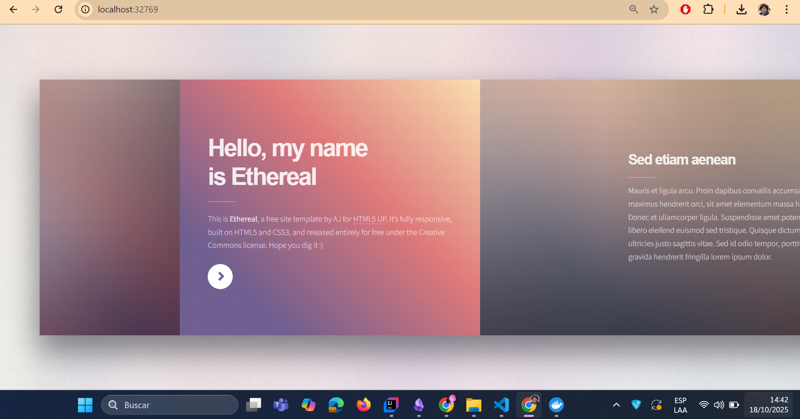

# BIND MOUNT
En un bind mount mapeamos (montar) un directorio o archivo específico del sistema de archivos del host con una parte del sistema de ficheros del contenedor.

```
docker run -d --name <nombre contenedor> -v <ruta carpeta host>:<ruta carpeta contenedor> <imagen> 
```
ó
```
docker run -d --name <nombre contenedor> --mount type=bind,source=<ruta carpeta host>,target=<ruta carpeta contenedor> <imagen>
```
- destination, dst, target: La ruta donde se monta el archivo o directorio en el contenedor.
- source, src: El origen del montaje.
  
### En tu computador crear una carpeta llamada nginx y dentro de esta carpeta crea otra llamada html. Como se aprecia en la figura.


### Crear un contenedor con la imagen nginx:alpine, mapear todos por puertos, para la ruta carpeta host colocar el directorio en donde se encuentra la carpeta html en tu computador y para la ruta carpeta contenedor: /usr/share/nginx/html (esta ruta se obtiene al revisar la documentación de la imagen)


COMANDO (mapear todos los puertos con -P usando --mount):

```powershell
# Ejecuta (usa PowerShell):

docker run -d --name mi-nginx --mount type=bind,source="C:\Users\INTEL\Documents\nginx\html",target=/usr/share/nginx/html -P nginx:alpine
```

### ¿Qué sucede al ingresar al servidor de nginx?
Al acceder a http://localhost verás el contenido que está en la carpeta `html` del host. Si no hay un `index.html` en la carpeta montada, nginx no mostrará la página por defecto (puede devolver 404 o una página vacía), porque el bind mount oculta el contenido original de la imagen en esa ruta.

### ¿Qué pasa con el archivo index.html del contenedor?
El `index.html` incluido en la imagen queda oculto por el bind mount; no se borra de la imagen, pero mientras exista el montaje no será accesible desde el contenedor.

### Ir a [html5up.net](https://html5up.net/) y descargar un template gratuito, descomprimirlo dentro de tu computador en la carpeta html

### ¿Qué sucede al ingresar al servidor de nginx?
Al descomprimir el template dentro de la carpeta `html` del host, al ingresar a http://localhost nginx servirá los archivos del template (el sitio se mostrará según los archivos estáticos presentes en la carpeta montada).

### Eliminar el contenedor
Ejemplo de comando para detener y eliminar el contenedor:

```powershell
# Eliminar forzosamente (detiene y remueve)
docker rm -f mi-nginx

# O en dos pasos:
docker stop mi-nginx ; docker rm mi-nginx
```




### ¿Qué sucede al crear nuevamente un contenedor montado al directorio definidos anteriormente?
Si creas nuevamente un contenedor con el mismo bind mount, nginx volverá a servir los mismos archivos que estén en la carpeta `html` del host. Los archivos permanecen en el host aunque elimines el contenedor, por lo tanto el nuevo contenedor mostrará el contenido existente en esa carpeta.



