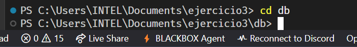
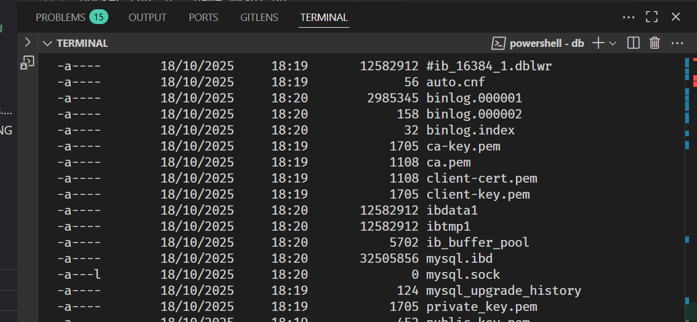
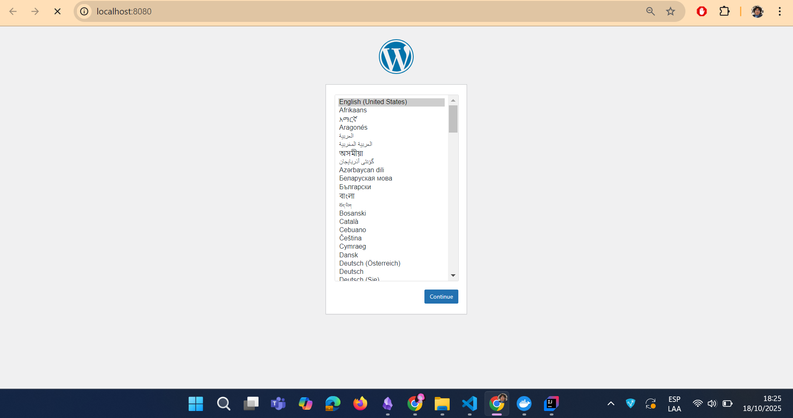
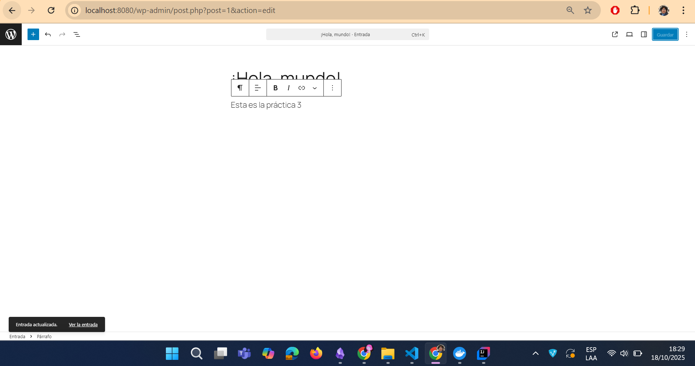
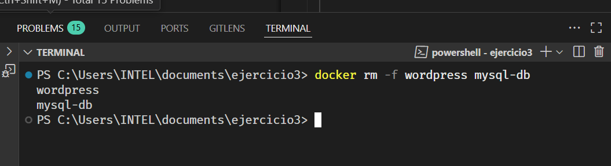
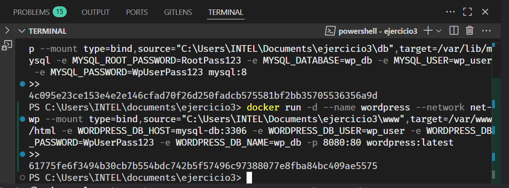

## Esquema para el ejercicio


### Crear red net-wp
COMANDO:

```powershell
# Crear la red
docker network create net-wp
```

### Para que persista la información es necesario conocer en dónde mysql almacena la información.
En el esquema del ejercicio carpeta del contenedor (a) es /var/lib/mysql

Ruta carpeta host: C:\Users\INTEL\Documents\ejercicio3\db

### ¿Qué contiene la carpeta db del host?
Después de iniciar el contenedor MySQL la carpeta `db` del host contendrá los archivos y directorios de datos de MySQL (archivos como `ibdata1`, `ib_logfile0`, y subdirectorios con las bases de datos y tablas: `mysql`, `performance_schema`, y la base creada `wp_db`, entre otros).



### Crear un contenedor con la imagen mysql:8  en la red net-wp, configurar las variables de entorno: MYSQL_ROOT_PASSWORD, MYSQL_DATABASE, MYSQL_USER y MYSQL_PASSWORD
COMANDO (reemplaza las contraseñas por las que desees):

```powershell
# Crear contenedor MySQL con bind mount para persistencia
docker run -d --name mysql-db --network net-wp --mount type=bind,source="C:\Users\INTEL\Documents\ejercicio3\db",target=/var/lib/mysql -e MYSQL_ROOT_PASSWORD=RootPass123 -e MYSQL_DATABASE=wp_db -e MYSQL_USER=wp_user -e MYSQL_PASSWORD=WpUserPass123 mysql:8
```

### ¿Qué observa en la carpeta db que se encontraba inicialmente vacía?

Verás que MySQL creó archivos y subcarpetas de datos (archivos binarios y directorios con las bases de datos), es decir los ficheros de almacenamiento de la base de datos.

### Para que persista la información es necesario conocer en dónde wordpress almacena la información.
En el esquema del ejercicio la carpeta del contenedor (b) es /var/www/html

Ruta carpeta host: C:\Users\INTEL\Documents\ejercicio3\www

### Crear un contenedor con la imagen wordpress en la red net-wp, configurar las variables de entorno WORDPRESS_DB_HOST, WORDPRESS_DB_USER, WORDPRESS_DB_PASSWORD y WORDPRESS_DB_NAME (los valores de estas variables corresponden a los del contenedor creado previamente)
COMANDO (reemplaza las rutas/credenciales si es necesario):

```powershell
# Crear contenedor WordPress con bind mount y apuntando a mysql-db
docker run -d --name wordpress --network net-wp --mount type=bind,source="C:\Users\INTEL\Documents\ejercicio3\www",target=/var/www/html -e WORDPRESS_DB_HOST=mysql-db:3306 -e WORDPRESS_DB_USER=wp_user -e WORDPRESS_DB_PASSWORD=WpUserPass123 -e WORDPRESS_DB_NAME=wp_db -p 8080:80 wordpress:latest
```

### Personalizar la apariencia de wordpress y agregar una entrada
Accede a http://localhost:8080 desde el navegador y completa la configuración, elige un tema y crea una entrada de ejemplo.




### Eliminar el contenedor y crearlo nuevamente, ¿qué ha sucedido?

Si eliminas el contenedor `wordpress` y lo vuelves a crear con el mismo bind mount, los archivos persistentes (archivos de WordPress y cualquier contenido almacenado en el directorio montado) permanecerán en la carpeta `C:\Users\INTEL\Documents\ejercicio3\www` del host. La base de datos persiste en `C:\Users\INTEL\Documents\ejercicio3\db`. Por tanto la configuración y el contenido (entradas, medios) deberían seguir disponibles al recrear los contenedores, siempre que montes las mismas carpetas y uses las mismas credenciales/DB.


